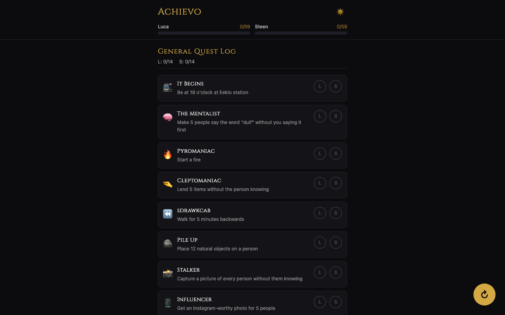

# Achievo

Offline-first PWA achievement tracker for a hiking/camping trip. Track progress for two players across General, Tarot, and AI challenge categories with QR code sync between devices.

Built with Vite, React 19, TypeScript, and Tailwind CSS 4.



## Features

- 59 achievements across 3 categories (General Quest Log, Tarot Trials, AI Experiments)
- Per-player toggle tracking (Luca & Steen) with localStorage persistence
- QR code sync — generate/scan to merge state between two phones, no internet needed
- Experimental Web Bluetooth sync
- Dark/light RPG-themed design with gold accents
- Installable PWA with full offline support
- Tarot God meta-achievement with unlock animation

## Dev

```
npm install
npm run dev
```
